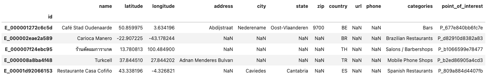
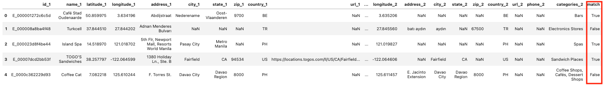

# Kaggle Location Matching Compeition
**Competition website:** https://www.kaggle.com/competitions/foursquare-location-matching


This is a Kaggle competion of entity resolution. The following description from the official site briefly explains the goal:
> In this competition, you’ll match POIs together. Using a dataset of over one-and-a-half million Places entries heavily altered to include noise, duplications, extraneous, or incorrect information, you'll produce an algorithm that predicts which Place entries represent the same point-of-interest. Each Place entry includes attributes like the name, street address, and coordinates. Successful submissions will identify matches with the greatest accuracy.

I joined the competition just a week before the closing and the final score was approximately 0.757. The model was trained with XGBoost algorithm.

## Tech Stack Highlights
* Handling real-world big data
    *  1138812 records with significant amount of missing values and noises
* EDA
    * Descriptive statistics
    * Visualization
* Data preprocessing and feature engineering
* Blocking and pair comparison with RecordLinkage
* Hyperparameter tuning with RandomizedSearchCV
* Model training and predicting with XGBoost
    * Splitting training and test datasets
    * Model evaluation with classification report and visualization

## Motivation
This is the first Kaggle competition I participated in. The objective was not to beat so many experienced data scientists and win a prize money, but to gain a hands-on experience on handling real-world big data. 

Also, this competition is about entity resolution / deduplication / record linkage. I believe this is a very useful technique when dealing with so many records that keep coming in, and we do not know whether there are redundant data. But surprisingly this topic is not popular in Data Science courses, so I am curious about how it works and believe I can apply a lot of knowledge I have learnt.

## Data
Datasets are available on the competition website.

## Workflow


This is a common workflow of building a classifier, but some may not be very familar with blocking so I would like to explain why it is necessary before building a model.

Let's have a look at the raw data:
<br>
The goal of this project is to find which places are actually refer to the same place in the real world and group them together.

You may notice that this can only be done when we pair up the entries and compare if they are really the same entity. According to the competition host, **the POI ("point_of_interest" column) is the only feature that must be true** and can be relied on when doing this step.

So we should get a table like the following:
<br>
The "match" column can only be True when 2 places have the same POI. This is the label for the model fitting, and also the thing I want to output after predictions.

The problem is that, if we pair up entries one by one, we will end up with over 600 billion pairs which are not possible to process efficiently. So we only want to pair up entries that have some kind of similarity (e.g. names) to avoid unnecessarily handling too much pairs. 

This is the blocking process and we will compare the pairs after this. Yes, we do not need this process if the dataset is not big or if the computer is powerful enough to handle such a great number of pairs. But most of the time in the real world with so many complicated data, this is a useful technique. 

You may also read [this](https://vintasoftware.github.io/deduplication-slides/#1/4---Indexing) for visual presentations of different blocking algorithms and how they work. 

## Codes
```location-matching-eda-model-building.ipynb```<br>
Performs EDA and model training. (Step 1 to 3 in the Workflow chart)

```location-matching-prediction.ipynb```<br>
Predicts and submits predictions. (From step 5 to submission in the Workflow chart)

```my_functions.py```<br>
Contains custom functions used in modelling and predicting.


## Challenges
* **Blocking - Accuracy vs Efficiency**<br>
    This is a problem of "Accuracy vs Efficiency". A desirable blocking should include all possible pairs. But when the data is so big, this is nearly impossible because this will drastically increase computational costs.
    
    On the other hand, we will sacrifice some real matches if we just include limited number of potential pairs. So we need to continuously optimize the blocking algorithm for better balance between accuracy and efficiency.
* **Missing values**<br>
    There are some columns with so many missing values. The "url" column even has missing values rate of 75%, and it is quite impossible for us to try to impute such kind of values. So we have to consider which features to use with consideration of the missing values.
* **Noises**<br>
    There are intentionally designed noises to simulate the real-world situation. We need to consider blocking on more than 1 column to avoid missing some of the potential pairs.
* **Multilingual datasets**<br>
    The datasets are about places in different countries so they may not be presented in English, and in worse cases, even for the same entity, different records are sometimes presented in English and sometimes in local languages. Transformation of data may be needed to tackle this problem.
* **Imbalanced samples**<br>
    Among all possible pairs, only 0.00029% really match. It is easy for the model to tend to have a negative prediction on everything if we do not handle well during model fitting.

## Next Steps
I planned to further optimize my model even after the competition ends, but unfortunately due to an issue probably on Kaggle's side, it is not possible to do any submissions now.

But still, I have concluded some potential ways for improvement.
* Transform all multilingual text to English.
* Rethink about blocking. While RecordLinkage is a conveient for this job, it is worth trying more algorithms such as TD-IDF, NearestNeighbors and so on to see whether accuracy or efficiency can be improved.
* Compare with more classifiers like Random Forest, AdaBoost, LightGBM and the like.
* Consider utilizing GPU to accelerate the training process.
* Try parellization with Spark DataFrame.
* Consider using clustering instead of classification.